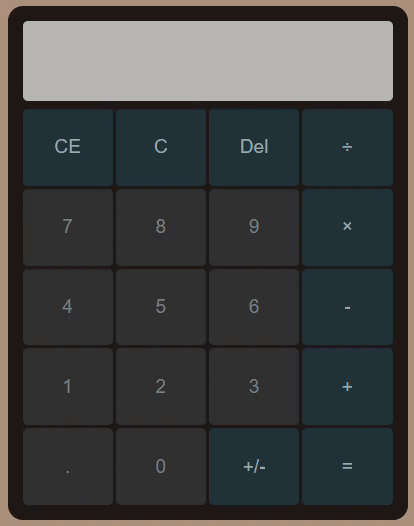
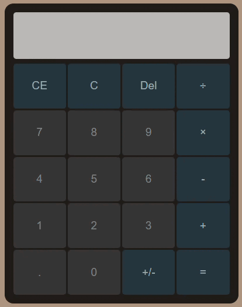

<h1>Calculadora</h1>
O projeto consiste em uma simples calculadora, baseada na calculadora do windows. Você pode ver como ficou o resultado final, a partir <a src="https://kaiobenevenuto.github.io/Calculadora/">DESSE LINK</a>.

##📱 Tecnologias
Esse projeto foi desenvolvido com as seguintes tecnologias:
- HTML
- CSS
- JavaScript

##🎬 GIF's demonstrativos

